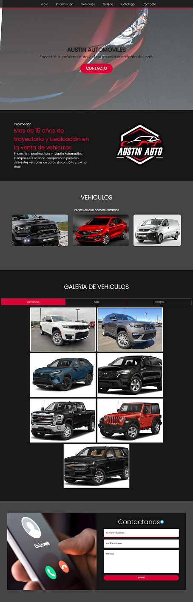
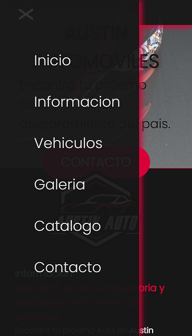
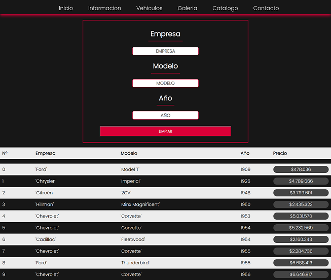
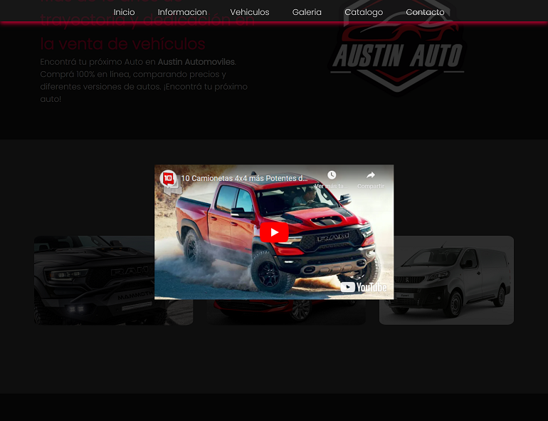

# CaC-22518
Codo a Codo - Comisión: 22518

Web:
https://ikaroyo.github.io/CaC-22518/catalogo.html

## Descripción
Este repositorio contiene el código fuente de la página web del curso de Codo a Codo 2022, Comisión 22518.

## Características
- HTML5
- CSS3
- JavaScript

## Breve descripción:
Es una página estilo one-page que además cuenta con una página separada donde se puede ver la simulación de un catálogo de vehículos que se encuentran a la venta con una serie de filtros para poder encontrar el vehículo deseado.

## Página principal:
 Cuenta con las siguientes secciones:
  - Hero
  - Información
  - Vehículos
  - Galeria
  - Contacto
  

## Pagina de catalogo:
  - Formulario de busqueda
  - Resultado de busqueda

### Breakpoints:

    - 576px
    - 768px
    - 992px

### Icons:
  - icons8.com

### Fonts:
  - Google Fonts (Poppins para la pagina en general y Cinzel para el navbar)

### Navbar 
- menú desplegable para dispositivos móviles.

### Catálogo 
- filtra vehículos mientras se escribe en el input de búsqueda.

### iframes 
- contienen videos de youtube en la sección vehículos.

### Carrusel de imágenes 

- En la sección galería.

## Otras características:

- Animaciones tanto en la página principal como en la página de catálogo.

- Paginas totalmente responsiva.

- Se utilizan tanto flex como grid para el diseño de la página.

- El formulario de contacto cuenta con validaciones mediante JavaScript.

- Se utilizan variables CSS para el manejo de colores.

- Se utilizan media queries para el manejo de los breakpoints.

- Se utilizan etiquetas semánticas para el manejo de la información.

- y mucho más...