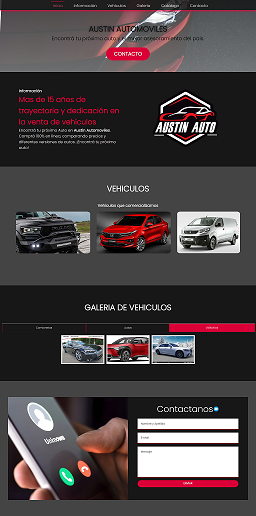
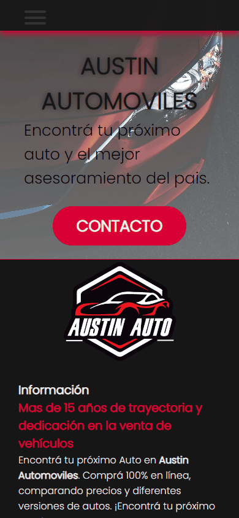
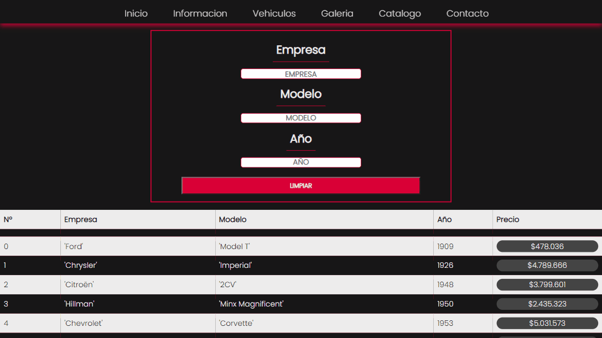
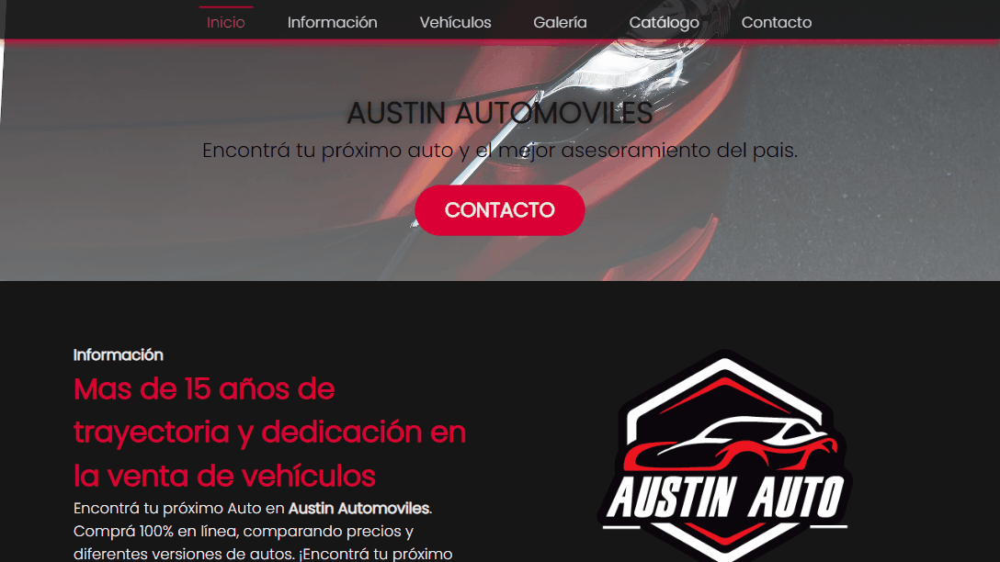

# CaC-22518

    Codo a Codo - Comisión: 22518

  

Web: <a href="https://ikaroyo.github.io/CaC-22518/">Link</a>

## Descripción

    Este repositorio contiene el código fuente de la página web del curso de Codo a Codo 2022, Comisión 22518.

## Tecnologias

    - HTML5
    - CSS3
    - JavaScript

## Breve descripción

    Es una página estilo one-page que además cuenta con una página separada 
    donde se puede ver la simulación de un catálogo de vehículos que se encuentran
    a la venta con una serie de filtros para poder encontrar el vehículo deseado.

    

>

# Páginas

## Página principal

### Secciones

    - Hero
    - Información
    - Vehículos
    - Galeria
    - Contacto

## Pagina de catalogo

### Secciones

    - Formulario de busqueda
    - Resultado de busqueda

## Breakpoints

    - 576px
    - 768px
    - 992px

## Icons

    - icons8.com

## Fonts

    - Google Fonts (Poppins para la pagina en general y Cinzel para el navbar)

## Navbar

    - menú desplegable para dispositivos móviles.

    

## Catálogo

    - Vehículos filtrables mientras se escribe en el input de búsqueda.

    

## iframes
  
    - contienen videos de youtube en la sección vehículos.

    

## Carrusel de imágenes
  
    - En la sección galería.

    

## API
  

    <a href="https://vehiculos-2b1d3-default-rtdb.firebaseio.com/vehiculos.json">Link</a>   

    - Se creó una base de datos json de más de 2000 vehículos y
    luego se incluyo como respuesta en el servicio Firebase Database Realtime.
  
## Otras características

    - Animaciones tanto en la página principal como en la página de catálogo.

    - Paginas totalmente responsiva.

    - Se utilizan tanto flex como grid para el diseño de la página.

    - El formulario de contacto cuenta con validaciones mediante JavaScript.

    - Se utilizan variables CSS para el manejo de colores.

    - Se utilizan media queries para el manejo de los breakpoints.
    
    - Se utilizan etiquetas semánticas para el manejo de la información.

    - Scrollbar personalizada.

    - y mucho más...